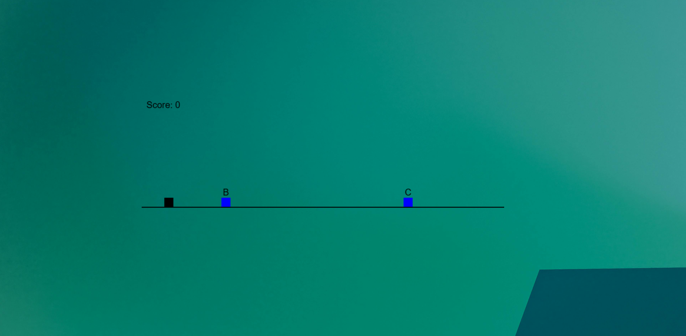
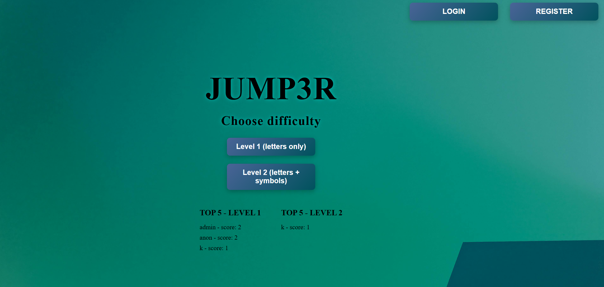

Jump3r - Fullstack 2D Game

It's a full-stack game built with Angular and FastApi, featuring:
- live leaderboard
- two difficulty levels
- user registration & login
- JWT authentication
- admin panel
- score storage
- Docker setup(backend + frontend)

Player jumps obstacles by pressing the matching keyboard letter.
Scores are tracked and saved to the leaderboard

Tech Stack

Frontend:
- Angular 20
- Standalone Components
- TypeScript
- Canvas API

Backend:
- FastAPI
- Python 3.11
- SQLAlchemy ORM
- JWT Auth
- SQLite

DevOps
- Docker
- docker-compose

How to run locally:

Backend:

cd backend

uvicorn app.main:app --reload --port 8000
----
Frontend:

cd frontend

npm install

npm start
----
How to run with Docker
docker compose up --build